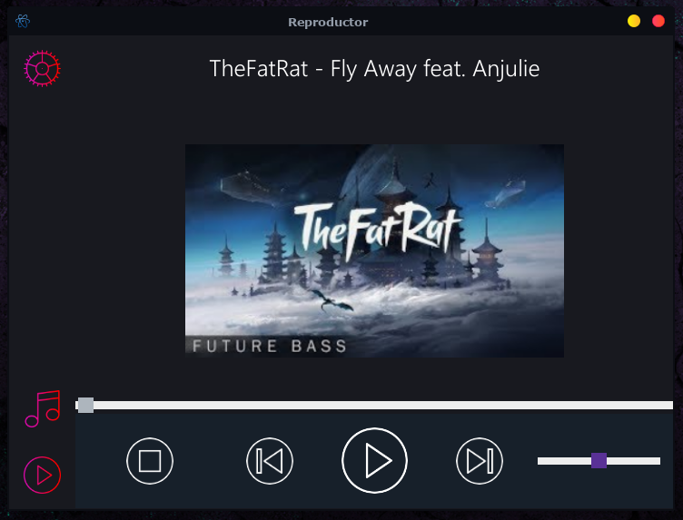

<h1>reproductor</h1>

Welcome, this is a simple player that was build on electron technology, if you want to use it, 
you have to download the dependencies an then, run the command 'npm start', that is especified in the package.json file.

the next step is go to config, and set the music folder where you have the tracks.

at moment, this player only use .mp3 files, in a future updates, it support more extensions.

#I hope you to enjoy this project.

#if you have some cuestion about it, contact me at:

#email: {
#  cristian-avendano@upc.edu.co,
#  cristian_ave04@hotmail.com
#}

#phone(whatsapp):{
#  +57 3123789557
#}
